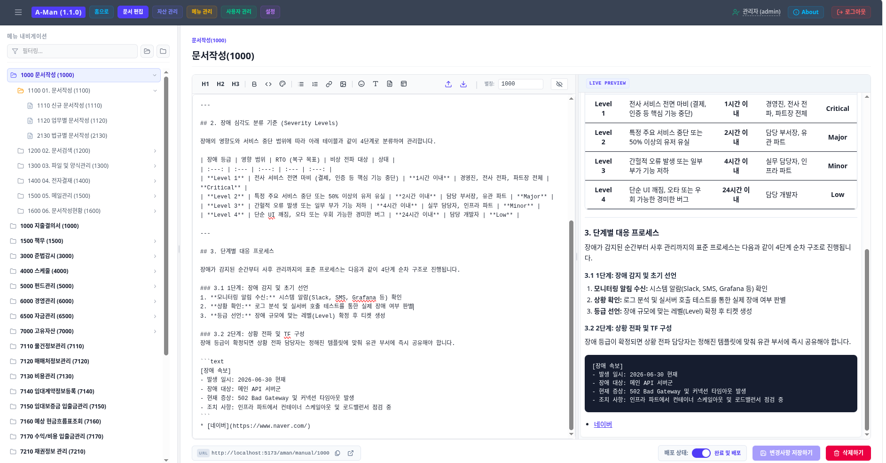

# A-Man(AssetERP 매뉴얼 시스템) 도움말

## 개요

A-Man은 [한국펀드서비스(주)](http://www.k-fs.co.kr/user1/index1)의 제품 [AssetERP](http://www.k-fs.co.kr/user1/product/asseterp)의 매뉴얼을 생성하고 조회하는 웹 어플리케이션입니다.

[마크다운(markdown)](https://namu.wiki/w/%EB%A7%88%ED%81%AC%EB%8B%A4%EC%9A%B4)형식의 데이터를 사용하여 관리하고 있으며 어플리케이션 자체의 소개는 About 메뉴를 참조해 주십시오.

본 문서는 A-Man의 문서를 생성하고 관리하는 사용자들 즉 관리자 그룹을 위한 도움말 문서입니다.

## 사용자의 구분

- 사용자는 일반사용자, 문서사용자, 관리자로 구분됩니다.
- **일반사용자**는 문서 조회 권한만 있으며 AssetERP를 사용하는 사람들입니다.
- **문서작성자**는 A-Man 에서 문서를 생성할 수 있는 사용자입니다.
- **관리자**는 A-Man에서 문서의 생성외에 사용자를 추가/삭제 할 수 있으며 설정을 변경할 수 있는 사용자입니다.

## 접속 URL

- 일반사용자 : [baseurl]**/aman/docs**
- 관리모드로 접속 : [baseurl]**/aman/admin**
    - login상태라면 바로 편집상태로 접속되며 로그인되어 있지 않으면 id/pw를 입력하여 로그인을 해야 함.
    - 로그아웃으로 명시적 로그아웃을 하지 않으면 14일간 로그인 상태를 유지합니다.

## 메뉴(Topbar) 설명

| 메뉴명 | 설명  |
|----------|----------|
| 홈으로  | 일반사용자 문서 보기로 이동   |
| 문서편집  | 메뉴를 클릭하여 해당문서를 markdown으로 편집   |
| 자산관리  | markdown편집 시 사용가능한 이모지, 특수기호, 상용구, 템플릿을 관리하는 화면   |
| 메뉴관리  | 메뉴란 AssetERP의 메뉴체계를 의미하며 문서편집의 tree구조로  표현되는 메뉴를 관리하는 화면  |
| 사용자관리  | 문서작성자,관리자를 추가/삭제/수정 할 수 있는 화면   |
| 설정  | A-Man 전반에 걸쳐 영향을 미치는 설정값들 조회, *단 수정/삭제/추가 할 수 없음*   |
| 로그인 사용자명 | 클릭시 사용자 password나 email를 수정할 수 있음|
| About | A-Man에 대한 전반적인 설명|
| Help | 본 문서로 **문서작성자**를 위한 설명서|

## 편집화면

