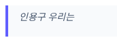
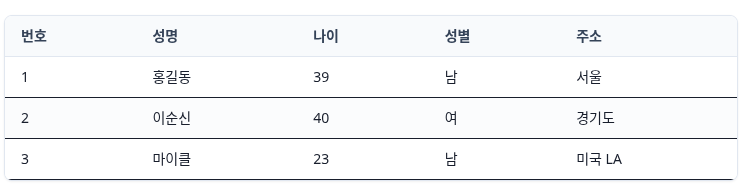

# A-Man (AssetERP 매뉴얼 시스템) 사용자 가이드 (v[version])

본 문서는 <strong>A-Man (AssetERP 매뉴얼 시스템)</strong>의 문서를 관리하고 생성하는 <strong>문서작성자 및 관리자</strong> 분들이 시스템의 모든 기능을 200% 활용할 수 있도록 돕기 위해 작성된 상세 도움말 가이드입니다. 

---

## 1. 개요 및 권한 안내

A-Man은 [한국펀드서비스(주)](http://www.k-fs.co.kr)의 핵심 자산운용 패키지인 <strong>AssetERP</strong>의 도움말과 매뉴얼을 생성하고 관리하는 통합 웹 문서 시스템입니다. 모든 도움말은 직관적이고 표준적인 <strong>마크다운(Markdown)</strong> 문법을 기반으로 실시간 작성 및 편집됩니다.

### 사용자의 역할 구분
| 권한 그룹 | 문서 조회 | 문서 편집 | 사용자 관리 | 환경 설정 | 주요 역할 |
|:---:|:---:|:---:|:---:|:---:|:---|
| <strong>일반 사용자</strong> | ✅ 가능 | ❌ 불가 | ❌ 불가 | ❌ 불가 | AssetERP 시스템에서 도움말 조회 (자산운용사 임직원 등) |
| <strong>문서 작성자</strong> | ✅ 가능 | ✅ 가능 | ❌ 불가 | ❌ 불가 | 매뉴얼 및 카테고리 문서 작성/수정 (당사 업무 부서원) |
| <strong>시스템 관리자</strong>| ✅ 가능 | ✅ 가능 | ✅ 가능 | ✅ 가능 | A-Man 시스템 전반 관리, 사용자 계정 생성, 환경설정 제어 |

---

## 2. 관리자 메뉴 (Topbar) 설명

관리자 모드로 접속(`[baseurl]/aman/admin`)하면 상단에 다음과 같은 핵심 관리용 툴바 메뉴들이 제공됩니다.

| 메뉴명 | 설명 |
|:---|:---|
| <strong>홈으로</strong> | 일반 사용자용 문서 조회 메인 화면(`/aman/docs`)으로 즉시 이동합니다. |
| <strong>문서편집</strong> | 왼쪽의 대/중/소 메뉴 트리 구조를 탐색하며 마크다운 에디터를 통해 실시간 매뉴얼을 작성하고 편집하는 메인 대시보드입니다. |
| <strong>자산관리</strong> | 문서 작성 시 자주 쓰이는 <strong>이모지, 특수기호, 상용구(문구), 템플릿(레이아웃)</strong>을 등록하고 편집하여 에디터 툴바 및 팝업 패널에 실시간 연동하는 자산 허브입니다. |
| <strong>메뉴관리</strong> | AssetERP의 3단계 메뉴 체계(대분류-중분류-소분류)와 연동되는 트리 카테고리를 추가, 수정, 삭제, 순서 변경하는 화면입니다. |
| <strong>사용자관리</strong>| 문서 작성자 및 관리자 계정을 추가, 비밀번호 수정 및 권한 부여를 처리하는 계정 관리 화면입니다. |
| <strong>설정</strong> | 시스템의 기본 폰트 크기, 이미지 업로드 크기 제한, 링크 새창 열기 여부 등 전반에 영향을 미치는 옵션들을 조회합니다. |
| <strong>사용자명 (비밀번호 변경)</strong>| 로그인 중인 본인의 계정명 버튼이며, 클릭 시 비밀번호와 이메일 등 개인정보를 수정할 수 있습니다. |
| <strong>About</strong> | A-Man 매뉴얼 시스템의 릴리즈 정보와 개발 철학, 오픈소스 가이드를 확인합니다. |
| <strong>Help</strong> | <strong>(본 문서)</strong> 문서 작성자들이 에디터의 모든 지능형 단축키를 손쉽게 마스터할 수 있도록 돕는 실전 매뉴얼입니다. |

---

## 3. 초강력 마크다운 에디터 사용법 (실전 가이드)

A-Man 에디터는 마크다운 문법을 신속하고 정확하게 작성할 수 있도록 최첨단 단축키와 반응형 기능을 탑재하고 있습니다.

### 3.1 단축키 일람표
에디터 내부에서 다음 단축키를 사용하여 빠르게 문서 서식을 지정할 수 있습니다.

| 기능 분류 | 수행 동작 | 단축키 |
|:---|:---|:---:|
| <strong>시스템</strong> | 현재까지 편집된 마크다운 문서 즉시 서버 저장 | <kbd>Ctrl</kbd> + <kbd>S</kbd> |
| <strong>팝업 패널</strong> | <strong>이모지</strong> 삽입 팝업 패널 활성화 (커서 위치 밀착) | <kbd>Ctrl</kbd> + <kbd>1</kbd> |
| <strong>팝업 패널</strong> | <strong>특수기호</strong> 삽입 팝업 패널 활성화 (커서 위치 밀착) | <kbd>Ctrl</kbd> + <kbd>2</kbd> |
| <strong>팝업 패널</strong> | <strong>상용구(자주 쓰는 문구)</strong> 삽입 패널 활성화 (커서 위치 밀착) | <kbd>Ctrl</kbd> + <kbd>3</kbd> |
| <strong>리스트/기호</strong>| 선택 영역 또는 현재 줄에 <strong>인용구 (`> `)</strong> 씌우기 | <kbd>Ctrl</kbd> + <kbd>8</kbd> |
| <strong>리스트/기호</strong>| 선택 영역 또는 현재 줄에 <strong>글머리 기호 (`- `)</strong> 씌우기 | <kbd>Ctrl</kbd> + <kbd>0</kbd> |
| <strong>리스트/기호</strong>| 선택 영역 또는 현재 줄에 <strong>번호 매기기 (`1. `)</strong> 씌우기 | <kbd>Ctrl</kbd> + <kbd>9</kbd> |
| <strong>표 (Table)</strong> | <strong>표 ↔ CSV 상호 양방향 즉시 변환</strong> / 기본 표 삽입 | <kbd>Ctrl</kbd> + <kbd>,</kbd> |
| <strong>인라인 서식</strong>| 선택 영역 텍스트 <strong>굵게 (Bold)</strong> 처리 (`**텍스트**`) | <kbd>Ctrl</kbd> + <kbd>B</kbd> |
| <strong>인라인 서식</strong>| 선택 영역 텍스트 *기울임 (Italic)* 처리 (`*텍스트*`) | <kbd>Ctrl</kbd> + <kbd>I</kbd> |
| <strong>인라인 서식</strong>| 선택 영역 텍스트 ~~취소선 (Strike)~~ 처리 (`~~텍스트~~`) | <kbd>Ctrl</kbd> + <kbd>Shift</kbd> + <kbd>S</kbd> |
| <strong>인라인 서식</strong>| 마크다운 링크 (`[텍스트](URL)`) 신속 삽입 | <kbd>Ctrl</kbd> + <kbd>L</kbd> |
| <strong>편의 기능</strong> | 현재 편집 중인 행을 <strong>화면 정중앙</strong>으로 스크롤 정렬 | <kbd>Alt</kbd> + <kbd>Z</kbd> |
| <strong>편의 기능</strong> | 커서 위치 상관없이 <strong>다음 줄로 즉시 강제 개행</strong> | <kbd>Shift</kbd> + <kbd>Enter</kbd> |

---

### 3.2 핵심 스마트 편집 기능 사용법

#### 💡 커서 밀착형 에셋 입력 패널 (<kbd>Ctrl</kbd>+<kbd>1</kbd>, <kbd>2</kbd>, <kbd>3</kbd>)
* **마우스 조작 불필요**: 본문을 작성하다가 단축키를 누르면, 현재 글자가 적히고 있는 입력 커서 바로 아래에 이모지/기호/상용구 선택 패널이 즉시 나타납니다.
* **키보드 내비게이션**: 패널이 열린 상태에서 키보드 **방향키(<kbd>←</kbd> <kbd>→</kbd> <kbd>↑</kbd> <kbd>↓</kbd>)**를 누르면 시각적 하이라이트 포커스가 움직이며, 원하는 아이템 위에서 **<kbd>Enter</kbd>**를 치는 순간 즉시 본문에 삽입됩니다. 
* 언제든지 **<kbd>ESC</kbd>**를 누르거나 패널 바깥을 클릭하면 패널이 깔끔하게 닫힙니다.

#### 💡 목록 & 인용구 자동 연속 및 자동 종료
* 글머리 기호(`- `), 번호 매기기(`1. `), 인용구(`> `)를 작성한 뒤 줄 바꿈을 하면, 다음 줄에 자동으로 `- `, `2. `, `> ` 기호가 선제적으로 생성됩니다.
* 만약 목록 작성을 마친 후 일반 줄로 돌아가고 싶다면, **빈 목록 기호 상태에서 <kbd>Enter</kbd>를 한 번 더** 누릅니다. 그러면 자동으로 줄 시작 기호가 지워지며 목록이 깔끔하게 종료됩니다.

#### 💡 마크다운 표 ↔ CSV 양방향 쾌속 토글 (<kbd>Ctrl</kbd>+<kbd>,</kbd>)
* **표 수정이 어려우신가요?** 마크다운으로 그려진 복잡한 표를 전체 드래그 선택하고 **<kbd>Ctrl</kbd> + <kbd>,</kbd>**를 누르면, 순식간에 `성명,나이,성별` 같은 쉼표로 구분된 CSV 데이터 텍스트로 풀어집니다.
* CSV 상태에서 값을 편하게 수정한 뒤, 다시 드래그하여 **<kbd>Ctrl</kbd> + <kbd>,</kbd>**를 누르면 완벽히 정렬된 깨끗한 마크다운 표로 깔끔하게 조립됩니다. 
* 아무것도 선택하지 않은 채 누르면 3x3의 기본 테이블 템플릿이 삽입됩니다.

#### 💡 클립보드 이미지 직접 붙여넣기 (<kbd>Ctrl</kbd>+<kbd>V</kbd>)
* AssetERP 화면을 캡처한 이미지나 PC에서 복사한 이미지 파일을 별도로 저장하고 올릴 필요가 없습니다.
* 에디터 영역 안에서 단축키 **<kbd>Ctrl</kbd> + <kbd>V</kbd>**를 누르면 백엔드 서버에 이미지가 즉시 자동 업로드되고, 본문에는 `` 와 같은 마크다운 코드가 생성되어 실시간 미리보기에 연동됩니다.

---

## 4. 실시간 미리보기 (Live Preview) 및 화면 정렬

* **실시간 양방향 스크롤 싱크**: 에디터 좌측 창을 스크롤하면 우측의 도움말 미리보기 화면도 정확히 같은 위치로 연동되어 움직입니다. 반대로 미리보기를 마우스 휠로 스크롤해도 에디터가 따라 움직입니다.
* **Alt + Z 화면 정렬**: 에디터 최하단에서 긴 문서를 편집할 때 모니터 아래쪽에서 계속 고개를 숙이고 작업해야 하는 불편함을 개선했습니다. **<kbd>Alt</kbd> + <kbd>Z</kbd>**를 입력하는 즉시 현재 커서 줄이 모니터 화면 정중앙으로 스크롤 재조정됩니다.

---

## 5. 이미지 예시 가이드

* **인용구 렌더링 예시**
  인용구는 좌측의 보라색 포인트 세로 바와 함께 기울임꼴로 차분하게 표출됩니다.
  

* **테이블(표) 렌더링 예시**
  마크다운 테이블은 둥근 모서리 상자와 은은하고 정돈된 로우(row) 테두리 선과 함께 현대적인 스타일로 자동 렌더링됩니다.
  

---

## 6. 고급 기능 가이드 (인터랙티브 안내)

<button class="tab-btn active" onclick="switchTab(event, 'tab-editor')">이미지 편집기 가이드</button>
<button class="tab-btn" onclick="switchTab(event, 'tab-assets')">아이콘 & 색상</button>

<!-- 탭 1: 이미지 편집기 -->

<h4>🎨 이미지 편집기 주요 단축키 및 레이어 정렬 가이드</h4>

A-Man 이미지 에디터는 마크다운 본문에 삽입된 이미지를 클릭하여 직접 그리기, 텍스트 삽입, 화살표 추가 및 도형 오버레이 등의 주석 작업을 수행할 수 있습니다.

<ul>
<li><strong>레이어 앞으로 한 단계 조정</strong>: <kbd>Ctrl</kbd> + <kbd>]</kbd></li>
<li><strong>레이어 뒤로 한 단계 조정</strong>: <kbd>Ctrl</kbd> + <kbd>[</kbd></li>
<li><strong>레이어 맨 앞으로 가져오기</strong>: <kbd>Ctrl</kbd> + <kbd>Shift</kbd> + <kbd>]</kbd></li>
<li><strong>레이어 맨 뒤로 내보내기</strong>: <kbd>Ctrl</kbd> + <kbd>Shift</kbd> + <kbd>[</kbd></li>
</ul>

<!-- 탭 2: 아이콘 & 색상 통합 탭 -->

<h4>🎨 AssetERP 사용 색상 목록</h4>

  

    
    blue :<code>456EA6</code>
    <i class="far fa-copy" style="cursor: pointer; color: #888;" onclick="navigator.clipboard.writeText('456EA6');" title="Hex 복사"></i>
  

  

    
    mint :<code>17A2B8</code>
    <i class="far fa-copy" style="cursor: pointer; color: #888;" onclick="navigator.clipboard.writeText('17A2B8');" title="Hex 복사"></i>
  

  

    
    red :<code>DD5E5E</code>
    <i class="far fa-copy" style="cursor: pointer; color: #888;" onclick="navigator.clipboard.writeText('DD5E5E');" title="Hex 복사"></i>
  

  

    
    orange :<code>E89646</code>
    <i class="far fa-copy" style="cursor: pointer; color: #888;" onclick="navigator.clipboard.writeText('E89646');" title="Hex 복사"></i>
  

  

    
    darkGray :<code>646362</code>
    <i class="far fa-copy" style="cursor: pointer; color: #888;" onclick="navigator.clipboard.writeText('646362');" title="Hex 복사"></i>
  

  

    
    lightBlue :<code>6AB6CF</code>
    <i class="far fa-copy" style="cursor: pointer; color: #888;" onclick="navigator.clipboard.writeText('6AB6CF');" title="Hex 복사"></i>
  

  

    
    green :<code>2EAC7E</code>
    <i class="far fa-copy" style="cursor: pointer; color: #888;" onclick="navigator.clipboard.writeText('2EAC7E');" title="Hex 복사"></i>
  

  

    
    dark :<code>343A40</code>
    <i class="far fa-copy" style="cursor: pointer; color: #888;" onclick="navigator.clipboard.writeText('343A40');" title="Hex 복사"></i>
  

  

    
    paleBlue :<code>EEF2FC</code>
    <i class="far fa-copy" style="cursor: pointer; color: #888;" onclick="navigator.clipboard.writeText('EEF2FC');" title="Hex 복사"></i>
  

  

    
    gray :<code>6B6B6B</code>
    <i class="far fa-copy" style="cursor: pointer; color: #888;" onclick="navigator.clipboard.writeText('6B6B6B');" title="Hex 복사"></i>
  

  <a href="./help/colors" target="_blank" style="display: inline-block; padding: 10px 20px; background-color: #17a2b8; color: white; border-radius: 6px; font-size: 14px; font-weight: bold; text-decoration: none; box-shadow: 0 4px 6px -1px rgba(23, 162, 184, 0.2); transition: background-color 0.2s;">
    🎨 전체 색상 찾기 (Color Palette)
  </a>

<h4>🔍 AssetERP 사용 FontAwesome 아이콘 목록</h4>

  💡 복사 아이콘(📋)을 클릭하면 파서가 인식할 수 있는 최적의 문자열이 클립보드에 자동 복사됩니다. 
  (단순 이름 복사 시 <code>fas fa-</code>가 자동 접두사로 붙으며, <code>far fa-</code>가 필요한 아이콘은 전체 이름이 복사됩니다.)

  

    <i class="fas fa-search"></i>
    :<code>search</code>
    <i class="far fa-copy" style="cursor: pointer; color: #888;" onclick="navigator.clipboard.writeText('search');" title="이름 복사"></i>
  

  

    <i class="fas fa-plus"></i>
    :<code>plus</code>
    <i class="far fa-copy" style="cursor: pointer; color: #888;" onclick="navigator.clipboard.writeText('plus');" title="이름 복사"></i>
  

  

    <i class="fas fa-user-times"></i>
    :<code>user-times</code>
    <i class="far fa-copy" style="cursor: pointer; color: #888;" onclick="navigator.clipboard.writeText('user-times');" title="이름 복사"></i>
  

  

    <i class="fas fa-envelope"></i>
    :<code>envelope</code>
    <i class="far fa-copy" style="cursor: pointer; color: #888;" onclick="navigator.clipboard.writeText('envelope');" title="이름 복사"></i>
  

  

    <i class="fas fa-calculator"></i>
    :<code>calculator</code>
    <i class="far fa-copy" style="cursor: pointer; color: #888;" onclick="navigator.clipboard.writeText('calculator');" title="이름 복사"></i>
  

  

    <i class="fas fa-check"></i>
    :<code>check</code>
    <i class="far fa-copy" style="cursor: pointer; color: #888;" onclick="navigator.clipboard.writeText('check');" title="이름 복사"></i>
  

  

    <i class="far fa-plus-square"></i>
    :<code>far fa-plus-square</code>
    <i class="far fa-copy" style="cursor: pointer; color: #888;" onclick="navigator.clipboard.writeText('far fa-plus-square');" title="이름 복사"></i>
  

  

    <i class="far fa-minus-square"></i>
    :<code>far fa-minus-square</code>
    <i class="far fa-copy" style="cursor: pointer; color: #888;" onclick="navigator.clipboard.writeText('far fa-minus-square');" title="이름 복사"></i>
  

  

    <i class="fas fa-bookmark"></i>
    :<code>bookmark</code>
    <i class="far fa-copy" style="cursor: pointer; color: #888;" onclick="navigator.clipboard.writeText('bookmark');" title="이름 복사"></i>
  

  

    <i class="fas fa-minus"></i>
    :<code>minus</code>
    <i class="far fa-copy" style="cursor: pointer; color: #888;" onclick="navigator.clipboard.writeText('minus');" title="이름 복사"></i>
  

  

    <i class="fas fa-trash"></i>
    :<code>trash</code>
    <i class="far fa-copy" style="cursor: pointer; color: #888;" onclick="navigator.clipboard.writeText('trash');" title="이름 복사"></i>
  

  

    <i class="fas fa-ban"></i>
    :<code>ban</code>
    <i class="far fa-copy" style="cursor: pointer; color: #888;" onclick="navigator.clipboard.writeText('ban');" title="이름 복사"></i>
  

  

    <i class="fas fa-exchange-alt"></i>
    :<code>exchange-alt</code>
    <i class="far fa-copy" style="cursor: pointer; color: #888;" onclick="navigator.clipboard.writeText('exchange-alt');" title="이름 복사"></i>
  

  

    <i class="fas fa-upload"></i>
    :<code>upload</code>
    <i class="far fa-copy" style="cursor: pointer; color: #888;" onclick="navigator.clipboard.writeText('upload');" title="이름 복사"></i>
  

  

    <i class="fas fa-download"></i>
    :<code>download</code>
    <i class="far fa-copy" style="cursor: pointer; color: #888;" onclick="navigator.clipboard.writeText('download');" title="이름 복사"></i>
  

  

    <i class="fas fa-eye"></i>
    :<code>eye</code>
    <i class="far fa-copy" style="cursor: pointer; color: #888;" onclick="navigator.clipboard.writeText('eye');" title="이름 복사"></i>
  

  

    <i class="fas fa-arrow-right"></i>
    :<code>arrow-right</code>
    <i class="far fa-copy" style="cursor: pointer; color: #888;" onclick="navigator.clipboard.writeText('arrow-right');" title="이름 복사"></i>
  

  

    <i class="fas fa-users"></i>
    :<code>users</code>
    <i class="far fa-copy" style="cursor: pointer; color: #888;" onclick="navigator.clipboard.writeText('users');" title="이름 복사"></i>
  

  

    <i class="fas fa-print"></i>
    :<code>print</code>
    <i class="far fa-copy" style="cursor: pointer; color: #888;" onclick="navigator.clipboard.writeText('print');" title="이름 복사"></i>
  

  

    <i class="fas fa-folder-plus"></i>
    :<code>folder-plus</code>
    <i class="far fa-copy" style="cursor: pointer; color: #888;" onclick="navigator.clipboard.writeText('folder-plus');" title="이름 복사"></i>
  

  

    <i class="fas fa-undo-alt"></i>
    :<code>undo-alt</code>
    <i class="far fa-copy" style="cursor: pointer; color: #888;" onclick="navigator.clipboard.writeText('undo-alt');" title="이름 복사"></i>
  

  

    <i class="fas fa-edit"></i>
    :<code>edit</code>
    <i class="far fa-copy" style="cursor: pointer; color: #888;" onclick="navigator.clipboard.writeText('edit');" title="이름 복사"></i>
  

  

    <i class="fas fa-bullseye"></i>
    :<code>bullseye</code>
    <i class="far fa-copy" style="cursor: pointer; color: #888;" onclick="navigator.clipboard.writeText('bullseye');" title="이름 복사"></i>
  

  

    <i class="fas fa-arrow-alt-circle-left"></i>
    :<code>arrow-alt-circle-left</code>
    <i class="far fa-copy" style="cursor: pointer; color: #888;" onclick="navigator.clipboard.writeText('arrow-alt-circle-left');" title="이름 복사"></i>
  

  

    <i class="fas fa-cog"></i>
    :<code>cog</code>
    <i class="far fa-copy" style="cursor: pointer; color: #888;" onclick="navigator.clipboard.writeText('cog');" title="이름 복사"></i>
  

  <a href="./help/icons" target="_blank" style="display: inline-block; padding: 10px 20px; background-color: #3b82f6; color: white; border-radius: 6px; font-size: 14px; font-weight: bold; text-decoration: none; box-shadow: 0 4px 6px -1px rgba(59, 130, 246, 0.2); transition: background-color 0.2s;">
    🔍 FontAwesome 전체 아이콘 찾기
  </a>

---
*본 도움말 문서는 A-Man 시스템 v[version] 릴리즈에 맞춰 항상 최신 단축키 정보로 갱신됩니다.*