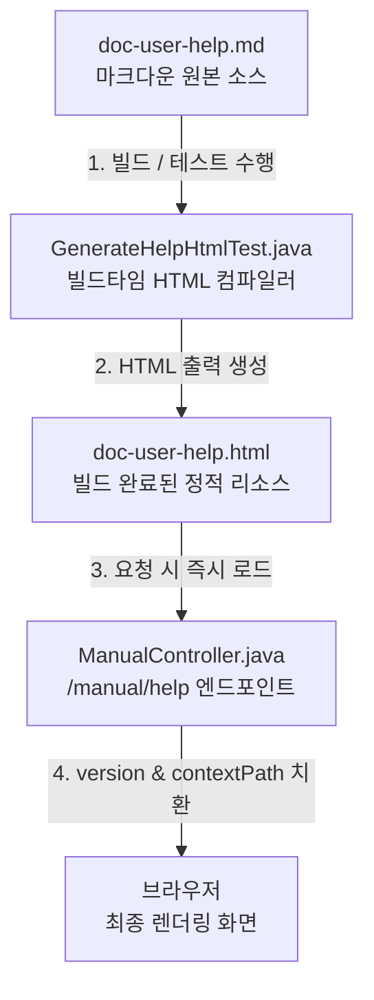

# 도움말 파일 처리 방식 고도화 설계 및 개발 계획

이 문서는 A-Man 프로젝트의 도움말(`/manual/help`) 제공 방식을 기존의 실시간 마크다운 파싱 방식에서 **"빌드 타임 마크다운 컴파일 및 HTML 서빙" 하이브리드 방식**으로 전환하기 위한 설계 및 개발 계획서입니다.

---

## 1. 개요 및 변경 목적
기존의 도움말 처리 방식은 요청이 들어올 때마다 서버 내 클래스패스 디렉토리에서 `doc-user-help.md`를 읽어 Flexmark 파서를 사용해 실시간으로 HTML로 파싱하고 조립했습니다.
이 방식은 아래와 같은 문제를 안고 있습니다:
1. **파싱 에러 및 예외**: 마크다운 렌더러가 특정 한글 기호나 괄호, 백틱 등의 문법을 예기치 않게 오동작 시킬 위험이 상존합니다.
2. **성능 부하**: 매번 파일 I/O를 일으키고 CPU를 사용하여 마크다운을 해석해 무거운 응답을 조립하는 오버헤드가 발생합니다.
3. **스타일 제어 한계**: 마크다운 변환 결과물에 정교한 HTML/CSS/JS 구조나 커스텀 레이아웃을 밀어 넣기 복잡합니다.

**변경 모델 (하이브리드 방식)**:
* **원본(Source of Truth)**: 수정하기 편한 `doc-user-help.md` 마크다운 파일을 그대로 유지합니다.
* **컴파일러**: 빌드/테스트 시점(혹은 로컬 수동 개발 시점)에 마크다운 파일을 한 번 파싱하여 예쁜 입체형 버튼과 CSS, 목차 스크립트가 온전히 임베딩된 완제품 `doc-user-help.html`로 자동 변환합니다.
* **런타임 서빙**: Spring Boot 백엔드는 런타임에 빌드된 `doc-user-help.html` 스트림을 읽어 contextPath와 version 정보만 단순 텍스트 치환하여 초고속으로 리턴합니다.

---

## 2. 아키텍처 다이어그램



---

## 3. 세부 변경 사항

### A. 빌드타임 컴파일러 클래스 추가 (테스트 스위트 통합)
* **경로**: `backend/src/test/java/kr/co/kfs/aman/GenerateHelpHtmlTest.java`
* **기능**:
  1. `backend/src/main/resources/help/doc-user-help.md` 파일을 읽습니다.
  2. `ManualController`의 굵은 글씨 전처리 및 백틱 버튼 치환(`preprocessBackticks`) 로직을 그대로 수행합니다.
  3. Flexmark 파서를 구동해 마크다운 본문을 HTML 바디로 빌드합니다.
  4. 본문 양옆을 스타일시트(FontAwesome, Custom CSS)와 인터랙티브 스크립트(탭 전환, Floating 목차)로 감싸 완성형 HTML을 만듭니다.
  5. 템플릿 코드 내부의 컨텍스트 경로(예: `/aman/`)를 나중에 치환할 수 있도록 `[contextPath]` 플레이스홀더로 치환합니다.
  6. 결과물 문자열을 `backend/src/main/resources/help/doc-user-help.html` 파일로 내보냅니다.
* **빌드 자동화 연동**: 이 제너레이터는 JUnit 5 단위 테스트 형태로 구현되므로, 개발자가 Gradle 빌드(`./gradlew build`)나 배포 파일 생성(`bootWar`)을 실행할 때 자동으로 실행되어 항상 최신 마크다운 내용이 HTML 파일로 자동 반영됩니다.

### B. 백엔드 컨트롤러 리팩토링
* **파일**: `backend/src/main/java/kr/co/kfs/aman/controller/ManualController.java`
* **변경 영역**: `getHelpPage` 메소드
* **수정안**:
  - `doc-user-help.md` 대신 `doc-user-help.html` 리소스를 읽어옵니다.
  - 마크다운 파싱 및 무거운 정규식 전처리 코드를 완전히 걷어내고, 읽어온 HTML 파일 내용에서 두 가지만 단순 교체합니다:
    * `[version]` ➔ 실제 어플리케이션 버전(`appVersion`)
    * `[contextPath]` ➔ 동적 서블릿 컨텍스트 경로(`request.getContextPath()`)
  - 치환된 전체 HTML 본문을 `ResponseEntity.ok()`로 반환합니다.

---

## 4. 기존 서비스 영향도 및 안정성 검증 (영향도 Zero 보장)

기존 도움말과 일반 메뉴얼(/manual/{aka})은 백엔드의 마크다운 파싱 메소드(`parseMarkdownToHtml`)를 공유하고 있었습니다. 만약 도움말 HTML 변환 과정에서 백틱 처리 등을 고도화하기 위해 이 공통 메소드를 직접 수정한다면 기존 서비스에 영향을 줄 우려가 있습니다.

이러한 부작용을 원천 차단하기 위해 다음과 같은 **격리(Isolation) 설계**를 적용합니다:

1. **공통 런타임 코드 무수정**: 
   * [ManualController.java](file:///home/kdy987/work/aman/backend/src/main/java/kr/co/kfs/aman/controller/ManualController.java)의 `parseMarkdownToHtml` 메서드와 백틱 치환 함수들은 **단 한 줄도 수정하지 않고 그대로 유지**합니다. 
   * 따라서 일반 사용자가 조회하는 기존의 개별 메뉴얼 화면(`/manual/{aka}`)은 기존과 100% 동일하게 동작하며 영향도가 전혀 없습니다.
2. **도움말 컴파일 로직의 테스트 코드 격리**:
   * 도움말 컴파일러인 `GenerateHelpHtmlTest.java`가 내부적으로 백틱 처리를 커스터마이징하거나 변경하더라도, 이 로직은 빌드/테스트 타임(개발 환경)에만 독립적으로 작동하여 정적 HTML을 만들어 낼 뿐 런타임 서비스 코드에는 아무런 영향을 주지 않습니다.
3. **런타임 의존성 제거**:
   * 실서버(`/manual/help`)의 런타임 구동 시점에는 복잡한 마크다운 파싱 알고리즘을 타지 않고 이미 완성된 HTML 스트링의 단순 문자열 치환만 일어나므로, 런타임 오류 가능성이 차단되고 완벽히 격리됩니다.

---

## 5. 검증 계획

### 자동화 빌드 테스트
1. 아래 Gradle 테스트 명령어를 실행하여 HTML 컴파일러가 오류 없이 구동하고 새로운 HTML을 정상적으로 쓰는지 검증합니다:
   ```bash
   ./gradlew -p backend test --tests "kr.co.kfs.aman.GenerateHelpHtmlTest"
   ```
2. `./bm.sh compile` 또는 `./bm.sh build` 명령을 수행하여 전체 프로젝트 컴파일 및 리소스 처리가 오류 없이 완수되는지 확인합니다.

### 수동 기능 테스트
1. 브라우저로 `http://localhost:5173/aman/manual/help` 경로에 접속합니다.
2. 우측 목차 트리(TOC) 클릭 이동, 다크 모드 스타일, FontAwesome 아이콘, 입체형 마케팅 키보드 버튼들이 정상 렌더링되는지 눈으로 확인합니다.
3. 도움말 내부의 이미지 파일들이 정상적인 contextPath 주소(`/aman/manual/help/image/...`)를 타고 뜨는지 개발자 도구를 통해 점검합니다.
