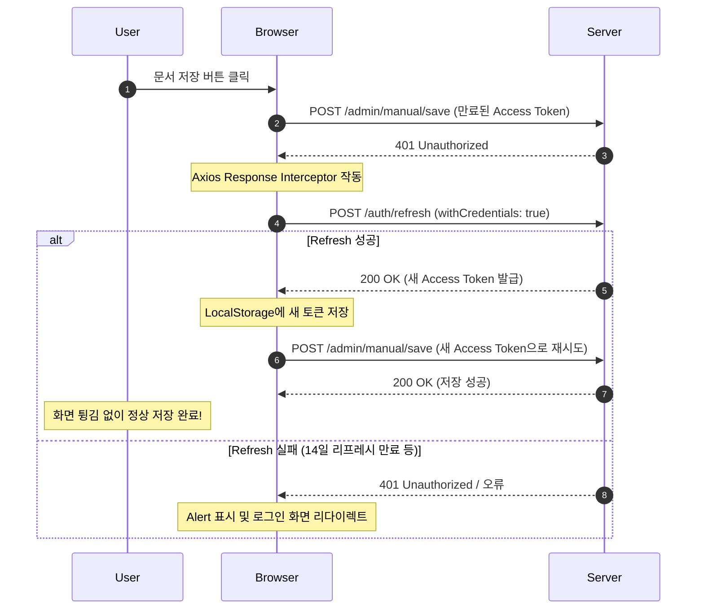

# 로그인 세션 만료 및 작업 유실 원인 분석 및 개선 계획

## 1. 문제 분석
사용자가 문서 작성 중 **"로그인 세션이 만료되었습니다. 다시 로그인해주세요."** 메시지와 함께 작업 내용을 유실하게 되는 문제는 다음과 같은 세부 원인들에 의해 발생합니다.

### 1) 타이머 정지 (Tab Throttling & PC Sleep)
* 프론트엔드의 `App.tsx`에서 1분 주기로 `setInterval`을 돌려 토큰 만료 5분 전에 `/auth/refresh`를 호출하도록 설계되어 있습니다.
* 하지만 브라우저는 백그라운드 탭이나 PC 절전(Sleep) 모드 진입 시 JavaScript 타이머 작동을 극도로 제한하거나 중단합니다.
* 이에 따라, 사용자가 자리를 비웠다가 돌아오면 `accessToken`이 이미 만료(1시간 경과)된 상태가 됩니다.

### 2) 401/403 발생 시 즉각 리다이렉트 (가장 치명적인 원인)
* 현재 `apiClient.ts`와 `App.tsx`에 등록된 Axios Response Interceptor는 401 또는 403 에러를 수신하면 **아무런 재시도 없이 곧바로 `alert`를 띄우고 로그인 화면(`/aman/login`)으로 리다이렉트**해버립니다.
* React 상태는 인메모리(In-Memory)이므로, 강제 리다이렉트되는 순간 사용자가 편집 중이던 문서 폼 데이터가 전부 날아갑니다.

### 3) API 요청 시 쿠키 전송 문제
* 백엔드의 `/auth/refresh` API는 HTTP 쿠키(`refresh_token`)를 기반으로 갱신을 진행합니다.
* 하지만 프론트엔드의 Axios 클라이언트에는 `withCredentials: true` 설정이 누락되어 있어, 크로스 오리진(CORS) 또는 특정 브라우저 보안 환경에서 쿠키 전송이 제한될 여지가 있습니다.

---

## 2. 제안하는 개선 방안

401/403 응답이 발생했을 때 즉시 세션을 종료하는 대신, **백그라운드에서 토큰을 실시간으로 갱신한 후 실패했던 요청을 다시 시도(Retry)**하는 구조로 개선합니다.



---

## 3. 세부 변경 계획

### [Component: Frontend / Authentication & API Client]

#### [MODIFY] [apiClient.ts](file:///home/kdy987/work/aman/frontend/src/lib/apiClient.ts)
* Axios 인스턴스 설정에 `withCredentials: true`를 추가하여 리프레시 토큰 쿠키가 서버로 정상 전달되도록 합니다.
* Response Interceptor에 401/403 에러 발생 시의 자동 재시도 로직을 적용합니다.
* 다중 요청이 동시에 실패할 경우 리프레시 요청이 중복해서 날아가지 않도록 **대기 큐(Queue) 처리**를 추가합니다.

#### [MODIFY] [App.tsx](file:///home/kdy987/work/aman/frontend/src/App.tsx)
* `App.tsx`의 Axios Response Interceptor 설정을 제거하거나 `apiClient`와 일원화합니다. (현재 `apiClient`와 `axios` 기본 인스턴스 둘 다에 Interceptor가 개별 적용되어 있어 중복 얼럿이 발생할 수 있는 문제를 방지합니다.)
* 브라우저가 다시 활성화될 때(`visibilitychange` 이벤트) 즉시 토큰을 점검하도록 보완합니다.

---

## 4. 상세 코드 구현 예시 (Axios Interceptor)

`apiClient.ts`에 도입할 Interceptor 구조 예시입니다.

```typescript
let isRefreshing = false;
let failedQueue: any[] = [];

const processQueue = (error: any, token: string | null = null) => {
  failedQueue.forEach((prom) => {
    if (error) {
      prom.reject(error);
    } else {
      prom.resolve(token);
    }
  });
  failedQueue = [];
};

instance.interceptors.response.use(
  (response) => response.data,
  async (error) => {
    const originalRequest = error.config;
    const isLoginRequest = originalRequest?.url?.includes('/auth/login');
    const isRefreshRequest = originalRequest?.url?.includes('/auth/refresh');

    // 401/403 에러이고, 로그인/리프레시 요청이 아닌 경우 자동 갱신 시도
    if (
      error.response &&
      (error.response.status === 401 || error.response.status === 403) &&
      !isLoginRequest &&
      !isRefreshRequest &&
      !originalRequest._retry
    ) {
      if (isRefreshing) {
        // 이미 갱신 중인 경우 갱신이 완료될 때까지 대기 큐에 저장
        return new Promise((resolve, reject) => {
          failedQueue.push({ resolve, reject });
        })
          .then((token) => {
            originalRequest.headers.Authorization = `Bearer ${token}`;
            return instance(originalRequest);
          })
          .catch((err) => {
            return Promise.reject(err);
          });
      }

      originalRequest._retry = true;
      isRefreshing = true;

      try {
        // 리프레시 요청 시 쿠키 전송 보장
        const data = await instance.post<any>('/auth/refresh', {}, { withCredentials: true });
        const newAccessToken = data.accessToken;

        if (newAccessToken) {
          const userStr = localStorage.getItem('aman_user');
          if (userStr) {
            const user = JSON.parse(userStr);
            localStorage.setItem('aman_user', JSON.stringify({ ...user, accessToken: newAccessToken }));
          }

          processQueue(null, newAccessToken);
          originalRequest.headers.Authorization = `Bearer ${newAccessToken}`;
          return instance(originalRequest);
        }
      } catch (refreshError) {
        processQueue(refreshError, null);
        // 리프레시마저 완전히 실패한 경우에만 최종 로그아웃 처리
        localStorage.removeItem('aman_user');
        alert('로그인 세션이 만료되었습니다. 다시 로그인해주세요.');
        window.location.href = '/aman/login';
        return Promise.reject(refreshError);
      } finally {
        isRefreshing = false;
      }
    }

    return Promise.reject(error);
  }
);
```

---

## 5. 검증 계획

### 1) 수동 검증 시나리오
1. **토큰 수명 단축 테스트**:
   * 백엔드 `application.properties` (또는 `JwtTokenProvider.java`)에서 `spring.security.jwt.access-expiration` 값을 `10000` (10초)로 임시 변경한 후 빌드하여 가동합니다.
2. **백그라운드 차단 상태 테스트**:
   * 편집 화면을 열어두고 10초 이상 아무 동작도 하지 않습니다.
   * `accessToken`이 만료된 후, 문서를 수정하고 "저장" 버튼을 누릅니다.
3. **결과 확인**:
   * 네트워크 탭을 확인하여 만료된 요청이 `401`을 반환한 후, 자동으로 `/auth/refresh` API를 호출하고 성공적으로 200 응답과 새 토큰을 획득하는지 확인합니다.
   * 최초 실패했던 저장 요청이 자동으로 재요청(Retry)되어 성공 처리되는지 검증합니다.
   * 화면 튕김(로그아웃) 없이 저장이 완료되는지 확인합니다.
