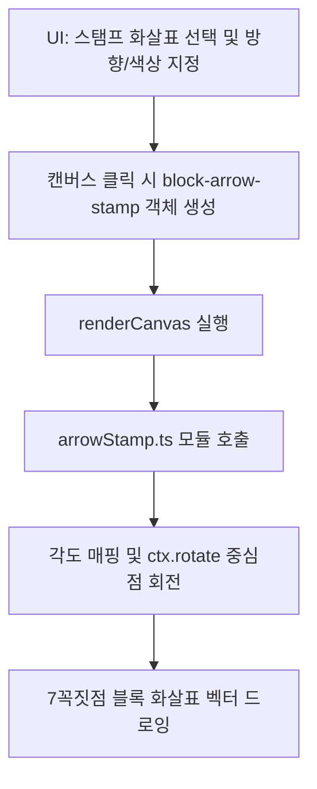

# 구현 계획: 하이브리드 블록 화살표 스탬프 도구 구현 (stamp_implementation_plan.md)

이 문서는 사용자의 "벡터와 래스터 조합 및 8방위 조작" 의견을 적극 수용하여 **하이브리드 형태의 블록 화살표 스탬프(Block Arrow Stamp) 도구**를 설계하고 구현하기 위한 기술 계획서입니다.

---

## 1. Goal Description (목표 정의)
* **목표**: 캔버스 상에 PicPick과 같이 고정된 모양의 화살표를 "쿵 찍은" 후, 이리저리 이동하거나 크기를 정밀 제어하는 **하이브리드 블록 화살표 스탬프(Block Arrow Stamp) 도구**를 추가합니다.
* **해결하는 문제**: 
  - 단순 이모지 화살표(방안 C)는 회색 테두리 배경 등 OS 폰트 제약으로 시인성이 어긋납니다.
  - 단순 비트맵 캡처본(방안 B)은 해상도가 깨지고 색상 변경이 어렵습니다.
  - 따라서 **스탬프의 간편한 조작 UX(래스터) + 깨끗하고 색상 변경이 자유로운 렌더링(벡터)의 장점을 결합한 하이브리드 방식**을 최종 제안 및 구현합니다.
* **모듈화 아키텍처**: 3,000라인이 넘는 `ActionImageEditor.tsx`의 가독성을 지키고 향후 다양한 스탬프 확장이 쉽도록, 화살표 다각형 드로잉 알고리즘은 **별도의 모듈인 [arrowStamp.ts](file:///home/kdy987/work/aman/frontend/src/components/imageditor/arrowStamp.ts)로 완전히 분리**하여 개발합니다.

---

## 2. 하이브리드 벡터 스탬프 디자인 & 작동 원리

> [!IMPORTANT]
> **핵심 설계: 캔버스 중심점 회전(Rotation)을 이용한 8방위(360도 가능) 벡터 화살표 스탬프**

### 🛠️ 작동 메커니즘
1. **스탬프 생성**:
   - 사용자가 상단 툴바에서 `스탬프 화살표`를 선택하고, 우측 속성 패널에서 **방향(8방위 버튼)**, **색상**, **크기(1-5단계)**를 결정합니다.
   - 캔버스의 특정 위치를 **클릭**하면, 선택된 속성을 반영하여 `width`와 `height` 영역을 지닌 `block-arrow-stamp` 아이템이 그 자리에 추가됩니다.
2. **마우스 조작**:
   - 스탬프는 독립된 객체로 간주되어 마우스 포인터 모드에서 이동 및 모서리 조절점을 활용한 **크기 조절(Resize)**이 완벽하게 지원됩니다.
3. **벡터 렌더링**:
   - `renderCanvas` 시점에 화살표의 중심점 $\mathbf{C}(cx, cy)$를 기준으로 지정된 방향 각도만큼 캔버스 좌표를 회전(`ctx.rotate`) 시킵니다.
   - 회전된 좌표계에서 **두껍고 선명한 블록 화살표 다각형(7-Point Polygon)**을 지정된 색상으로 채워서 실시간 드로잉합니다.
   - 이로 인해 확대/축소를 하더라도 래스터 이미지처럼 깨지지 않는 **선명한 무손실 화질**이 유지됩니다.

---

## 3. 8방위 방향 설정 및 각도 매핑
사용자가 UI에서 선택한 8방향 단추는 다음과 같이 라디안 각도로 캔버스 드로잉 시점에 매핑됩니다:
* `right` (→, 기본값): `0` ($0^\circ$)
* `down-right` (↘): `Math.PI * 0.25` ($45^\circ$)
* `down` (↓): `Math.PI * 0.5` ($90^\circ$)
* `down-left` (↙): `Math.PI * 0.75` ($135^\circ$)
* `left` (←): `Math.PI` ($180^\circ$)
* `up-left` (↖): `Math.PI * 1.25` ($225^\circ$)
* `up` (↑): `Math.PI * 1.5` ($270^\circ$)
* `up-right` (↗): `Math.PI * 1.75` ($315^\circ$)

---

## 4. Proposed Changes (변경 사항 요약)

### [frontend Component]

#### [NEW] [arrowStamp.ts](file:///home/kdy987/work/aman/frontend/src/components/imageditor/arrowStamp.ts)
* 8방향 각도 매핑 딕셔너리(`STAMP_ANGLES`)를 포함합니다.
* 중심점 이동, 회전, 7꼭짓점 다각형 생성 및 색상 칠하기를 담당하는 공용 함수 `drawBlockArrowStamp(ctx, x, y, width, height, direction, color)`를 외부에 노출합니다.

#### [MODIFY] [image_editor_types.ts](file:///home/kdy987/work/aman/frontend/src/components/imageditor/image_editor_types.ts)
* `ToolType`에 `'block-arrow-stamp'`를 추가합니다.
* `CanvasItem`의 `type`에 `'block-arrow-stamp'`를 허용하고, `stampDirection`(`left` 등) 및 `color`, `scale` 프로퍼티를 담을 수 있게 스펙을 확장합니다.

#### [MODIFY] [ActionImageEditor.tsx](file:///home/kdy987/work/aman/frontend/src/components/imageditor/ActionImageEditor.tsx)
* `activeTool === 'block-arrow-stamp'` 모드일 때 클릭 이벤트를 받아 지정된 크기(1-5단계 매핑 크기 예: 32px ~ 96px)로 스탬프 아이템을 생성하는 로직을 마운트합니다.
* `draw` 함수 루프 내부에서 `arrowStamp.ts` 모듈의 `drawBlockArrowStamp`를 호출하도록 렌더러를 연동합니다.
* 상단 툴바에 `스탬프 화살표` 실행 버튼을 배치합니다.

#### [MODIFY] [FloatingPropertyPanel.tsx](file:///home/kdy987/work/aman/frontend/src/components/imageditor/FloatingPropertyPanel.tsx)
* `block-arrow-stamp`가 선택되었거나 스탬프 도구가 활성화되었을 때 노출할 전용 인스펙터 속성 패널을 배치합니다.
  - **방향**: 8방향 화살표 기호가 새겨진 라디오/버튼 그룹 (←, ↖, ↑, ↗, →, ↘, ↓, ↙)
  - **크기**: 1~5단계 스펙 슬라이더
  - **색상**: 팔레트 색상 선택기

---

## 5. Verification Plan (검증 방안)

### Manual Verification (수동 테스트 항목)
1. 상단 툴바에서 `스탬프 화살표` 도구를 켭니다.
2. 속성창에서 `↘` 방향, `주황색`, `3단계 크기`를 고르고 캔버스를 클릭합니다.
3. 찌그러짐 없이 선명한 회색 배경 없는 주황색 대각선 화살표가 쿵 찍히는지 확인합니다.
4. 마우스 포인터 모드에서 조절점을 잡고 크기를 늘렸을 때 화살표 외곽 라인이 깨지지 않고 정밀하게 리사이즈되는지 봅니다.
5. 임시 저장 및 삭제, 키보드 Nudge(1px 미세 이동) 기능이 스탬프 아이템에도 올바르게 작동하는지 확인합니다.
